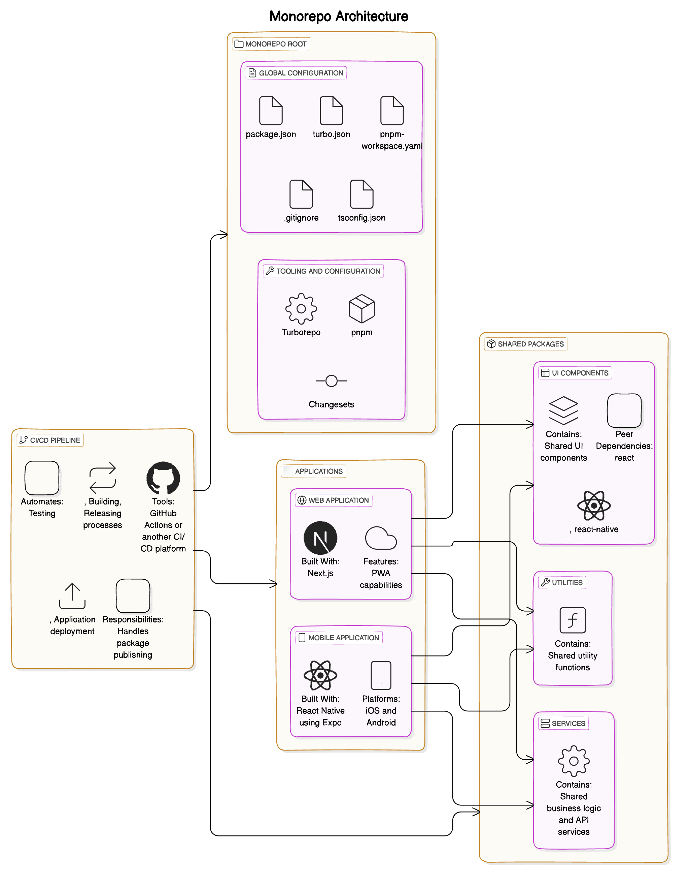

# Architecture Summary for a Cross-Platform Online & Offline Capable App Using NextJS and resuse code to support Native App in iOS & Android with Independent Package Releases Using Turborepo and **pnpm**

## Overview

The goal is to build an application that:

- **Works online and offline on the web**
- **Is available as a native app on iOS and Android**
- **Allows teams to release each component and shared library independently**
- **Uses semantic versioning for shared packages**

To achieve this, we'll use:

- **Next.js** for the web application with Progressive Web App (PWA) capabilities for offline functionality.
- **React Native** (with Expo) for mobile applications.
- **Turborepo** for managing a monorepo, enabling code sharing and independent package versioning.
- **pnpm** as the package manager for efficient monorepo management.
- **Shared Packages** for common components, utilities, and business logic, each with its own versioning.

---

## Folder Structure

```
root/
├── apps/
│   ├── web/          # Next.js app (web)
│   └── mobile/       # React Native app (iOS and Android)
├── packages/
│   ├── ui/           # Shared UI components (independently versioned)
│   ├── utils/        # Shared utilities and helper functions (independently versioned)
│   └── services/     # Shared business logic and services (independently versioned)
├── .turbo/           # Turborepo configuration
├── package.json
└── pnpm-workspace.yaml
```

---

## Architecture



---

# Step-by-Step Implementation Guide with Independent Releases Using **pnpm**

## Prerequisites

- **Node.js** (v14 or above)
- **pnpm** (v6 or above)
- **Git** for version control
- **Expo CLI** for React Native development

---

## Step 1: Install **pnpm**

1. **Install pnpm globally:**

   ```bash
   npm install -g pnpm
   ```

---

## Step 2: Initialize the Monorepo with Turborepo and **pnpm**

1. **Set Up the Monorepo Structure:**

   ```bash
   mkdir your-app
   cd your-app
   pnpm init -y
   ```

2. **Create `pnpm-workspace.yaml` at the root:**

   ```yaml
   # pnpm-workspace.yaml
   packages:
     - 'apps/*'
     - 'packages/*'
   ```

3. **Create Directory Structure:**

   ```bash
   mkdir -p apps/web apps/mobile packages/ui packages/utils packages/services
   ```

4. **Install Turborepo as a dev dependency:**

   ```bash
   pnpm add -D turbo
   ```

5. **Initialize Turborepo Configuration:**

   ```bash
   npx turbo init
   ```

6. **Update `package.json` for Scripts:**

   ```json
   // package.json
   {
     "private": true,
     "scripts": {
       "build": "turbo run build",
       "dev": "turbo run dev",
       "lint": "turbo run lint",
       "test": "turbo run test"
     },
     "devDependencies": {
       "turbo": "^1.4.0"
     }
   }
   ```

---

## Step 3: Set Up Independent Shared Packages

### 1. **Shared UI Components (`packages/ui`):**

- **Initialize Package:**

  ```bash
  cd packages/ui
  pnpm init -y
  ```

- **Update `package.json`:**

  ```json
  // packages/ui/package.json
  {
    "name": "@your-app/ui",
    "version": "0.1.0",
    "main": "index.js",
    "license": "MIT",
    "dependencies": {},
    "peerDependencies": {
      "react": "^17.0.2",
      "react-native": "^0.64.0"
    }
  }
  ```

- **Add Sample Component:**

  ```jsx
  // packages/ui/Button.js
  import React from 'react';
  import { TouchableOpacity, Text } from 'react-native';

  const Button = ({ title, onPress }) => (
    <TouchableOpacity onPress={onPress}>
      <Text>{title}</Text>
    </TouchableOpacity>
  );

  export default Button;
  ```

### 2. **Shared Utilities (`packages/utils`):**

- **Initialize Package:**

  ```bash
  cd ../utils
  pnpm init -y
  ```

- **Update `package.json`:**

  ```json
  // packages/utils/package.json
  {
    "name": "@your-app/utils",
    "version": "0.1.0",
    "main": "index.js",
    "license": "MIT",
    "dependencies": {}
  }
  ```

- **Add Sample Utility Function:**

  ```javascript
  // packages/utils/formatDate.js
  export const formatDate = (date) => {
    // Implement date formatting logic
  };
  ```

### 3. **Shared Services (`packages/services`):**

- **Initialize Package:**

  ```bash
  cd ../services
  pnpm init -y
  ```

- **Update `package.json`:**

  ```json
  // packages/services/package.json
  {
    "name": "@your-app/services",
    "version": "0.1.0",
    "main": "index.js",
    "license": "MIT",
    "dependencies": {
      "axios": "^0.21.1"
    }
  }
  ```

- **Add Sample Service:**

  ```javascript
  // packages/services/api.js
  import axios from 'axios';

  export const fetchData = async () => {
    const response = await axios.get('https://api.example.com/data');
    return response.data;
  };
  ```

---

## Step 4: Configure Independent Package Releases with Turborepo

### 1. **Set Up Publishing Workflow**

- **Install Changesets:**

  Changesets is a tool for managing versions and changelogs in a monorepo.

  ```bash
  cd ../../
  pnpm add -D @changesets/cli
  npx changeset init
  ```

- **Update Turborepo Configuration (`turbo.json`):**

  ```json
  // turbo.json
  {
    "$schema": "https://turbo.build/schema.json",
    "pipeline": {
      "build": {
        "outputs": ["dist/**", ".next/**"]
      },
      "publish": {
        "dependsOn": ["build"],
        "outputs": []
      }
    }
  }
  ```

### 2. **Configure Package Publishing**

- **Add Scripts to Root `package.json`:**

  ```json
  // package.json
  {
    "scripts": {
      "build": "turbo run build",
      "changeset": "changeset",
      "version-packages": "changeset version",
      "publish-packages": "turbo run publish --filter=./packages/*",
      "release": "pnpm version-packages && pnpm publish-packages"
    }
  }
  ```

- **Add `publish` Script to Each Package:**

  ```json
  // packages/ui/package.json
  {
    "scripts": {
      "build": "tsc",
      "publish": "npm publish --access public"
    }
  }
  ```

  Repeat for `packages/utils` and `packages/services`.

### 3. **Set Up Semantic Versioning with Changesets**

- **Creating a Changeset:**

  When you make changes to a package, create a changeset:

  ```bash
  npx changeset
  ```

  Follow the prompts to select the packages you've changed and specify the version bump type (patch, minor, major).

- **Versioning Packages:**

  ```bash
  pnpm version-packages
  ```

  This will update the `package.json` files with new versions based on the changesets.

- **Publishing Packages:**

  ```bash
  pnpm publish-packages
  ```

  This will run the `publish` script in each package, which should publish it to the npm registry.

### 4. **Configure NPM Publishing (Optional)**

If you plan to publish the packages to a private or public npm registry:

- **Create or Sign In to an NPM Account**

- **Set Up NPM Authentication:**

  ```bash
  npm login
  ```

- **Ensure Packages are Public (if Open Source):**

  In each `package.json`, set:

  ```json
  {
    "publishConfig": {
      "access": "public"
    }
  }
  ```

---

## Step 5: Update Applications to Consume Independently Versioned Packages

### 1. **Update Dependencies in Applications**

- **In `apps/web/package.json`:**

  ```json
  {
    "dependencies": {
      "@your-app/ui": "^0.1.0",
      "@your-app/utils": "^0.1.0",
      "@your-app/services": "^0.1.0",
      // other dependencies
    }
  }
  ```

- **In `apps/mobile/package.json`:**

  ```json
  {
    "dependencies": {
      "@your-app/ui": "^0.1.0",
      "@your-app/utils": "^0.1.0",
      "@your-app/services": "^0.1.0",
      // other dependencies
    }
  }
  ```

### 2. **Install Packages via NPM Registry**

After publishing the packages, install them in your applications:

```bash
cd apps/web
pnpm install
cd ../mobile
pnpm install
```

---

## Step 6: Continue Development with Independent Releases

### 1. **Making Changes to Packages**

- **Modify Code in `packages/*`.**

- **Create a New Changeset:**

  ```bash
  npx changeset
  ```

  - **Select the Packages to Version:**
    - Use the arrow keys to select the packages you changed.
  - **Choose the Version Bump Type:**
    - **Patch**: Backwards-compatible bug fixes.
    - **Minor**: Add functionality in a backwards-compatible manner.
    - **Major**: Making incompatible API changes.

- **Write a Summary of the Changes.**

### 2. **Version and Publish Packages**

- **Version Packages:**

  ```bash
  pnpm version-packages
  ```

- **Publish Packages:**

  ```bash
  pnpm publish-packages
  ```

### 3. **Update Applications**

- **Update Dependencies in Applications:**

  ```bash
  cd apps/web
  pnpm update @your-app/ui @your-app/utils @your-app/services
  ```

  ```bash
  cd ../mobile
  pnpm update @your-app/ui @your-app/utils @your-app/services
  ```

- **Test Applications to Ensure Compatibility.**

---

## Step 7: Implement Best Practices for Independent Package Management

### 1. **Maintain Clear Package Boundaries**

- Ensure that each package has a clear responsibility.
- Avoid circular dependencies between packages.

### 2. **Use Peer Dependencies Appropriately**

- **Shared Dependencies:** Declare `react` and `react-native` as peer dependencies in shared packages to avoid duplicate instances.

  ```json
  // packages/ui/package.json
  {
    "peerDependencies": {
      "react": "^17.0.2",
      "react-native": "^0.64.0"
    }
  }
  ```

### 3. **Automate Release Process**

- **Continuous Integration (CI):**

  Set up a CI pipeline (e.g., GitHub Actions) to automate the release process when changes are merged to the main branch.

- **Sample GitHub Action Workflow:**

  ```yaml
  # .github/workflows/release.yml
  name: Release Packages

  on:
    push:
      branches:
        - main

  jobs:
    release:
      runs-on: ubuntu-latest
      steps:
        - uses: actions/checkout@v2
        - uses: actions/setup-node@v2
          with:
            node-version: '14'
            registry-url: 'https://registry.npmjs.org/'
        - run: pnpm install --frozen-lockfile
        - run: pnpm build
        - run: npx changeset publish
          env:
            NODE_AUTH_TOKEN: ${{ secrets.NPM_TOKEN }}
  ```

### 4. **Changelog Management**

- **Changesets** automatically generate changelogs based on your changes.

- **Generate Changelog:**

  ```bash
  npx changeset changelog
  ```

### 5. **Semantic Versioning**

- **Follow Semantic Versioning Rules:**

  - **MAJOR** version when you make incompatible API changes.
  - **MINOR** version when you add functionality in a backwards-compatible manner.
  - **PATCH** version when you make backwards-compatible bug fixes.

- **Communicate Changes Clearly to Teams:**

  - Update documentation and notify teams about breaking changes.

---

## Step 8: Handling Dependencies Between Packages

### 1. **Internal Package Dependencies**

- **Declare Dependencies Properly:**

  If `@your-app/services` depends on `@your-app/utils`:

  ```json
  // packages/services/package.json
  {
    "dependencies": {
      "@your-app/utils": "^0.1.0"
    }
  }
  ```

### 2. **Version Bump Strategies**

- **Changesets** can handle automatic version bumps for dependent packages.

- **When a Dependency Changes:**

  - If `@your-app/utils` has a major update, `@your-app/services` may also need to be updated to use the new version.

### 3. **Monorepo Dependency Resolution**

- **pnpm Workspaces** allow local packages to be resolved without needing to publish to npm during development.

- **In Applications:**

  - During development, applications will use the local versions of packages.
  - For production builds, they will use the versions specified in `package.json`.

---

## Step 9: Continue Application Development with Shared Packages

### 1. **During Development**

- **Local Changes Reflect Immediately:**

  - Changes to packages in `packages/` are immediately available in `apps/` due to pnpm workspaces.

### 2. **Before Releases**

- **Ensure All Packages are Published:**

  - Run `pnpm release` to version and publish any changed packages.

- **Update Application Dependencies:**

  - After publishing, update the dependencies in the applications to use the latest versions.

---

## Step 10: Build and Deploy Applications

### 1. **Web Application**

- **Build with Latest Packages:**

  ```bash
  cd apps/web
  pnpm install --frozen-lockfile
  pnpm build
  ```

- **Deploy to Hosting Provider.**

### 2. **Mobile Application**

- **Build with Latest Packages:**

  ```bash
  cd ../mobile
  pnpm install --frozen-lockfile
  expo build:android
  expo build:ios
  ```

- **Publish to App Stores.**

---

# Best Practices for Organizing and Reusing Code with Independent Releases

1. **Clearly Define Package APIs**

   - Make sure each package has a well-defined public API.
   - Avoid exposing internal implementation details.

2. **Version Control**

   - Use semantic versioning to communicate the impact of changes.
   - Update dependent packages when breaking changes occur.

3. **Consistent Coding Standards**

   - Use shared ESLint and Prettier configurations.
   - Enforce code style across all packages.

4. **Documentation**

   - Each package should include comprehensive documentation.
   - Use tools like JSDoc or TypeDoc for generating API docs.

5. **Testing**

   - Write unit tests for each package.
   - Use tools like Jest and configure Turborepo to run tests in parallel.

6. **Code Reviews**

   - Encourage peer reviews for changes in shared packages.
   - Use pull requests to manage changes.

7. **Avoid Tight Coupling**

   - Design packages to be as independent as possible.
   - Minimize dependencies between packages.

8. **Communicate Changes**

   - Use the generated changelogs to inform teams of updates.
   - Hold regular meetings to discuss significant changes.

9. **Continuous Integration**

   - Automate testing and releases with CI/CD pipelines.
   - Ensure that all tests pass before packages are published.

10. **Monitor Package Usage**

    - Keep track of which applications use which versions of packages.
    - Plan for updates and deprecations accordingly.

---

# Conclusion

By updating the architecture to use **pnpm** as the package manager and support independent releases of components and shared libraries, teams can:

- **Work Autonomously:** Teams can develop and release their components without waiting for a monolithic release.
- **Improve Stability:** Changes in one package won't inadvertently affect others.
- **Enhance Collaboration:** Clear versioning and changelogs improve communication between teams.
- **Leverage pnpm's Efficiency:** pnpm provides efficient dependency management and disk space optimization, beneficial for monorepos.

Leveraging Turborepo and Changesets enables efficient management of a monorepo with independently versioned packages, ensuring that code sharing does not come at the expense of flexibility and control over individual components.

---

# Additional Resources

- **Server & Client Components:** [https://nextjs.org/learn/react-foundations/server-and-client-components]
- **Turborepo Documentation:** [https://turbo.build/repo/docs](https://turbo.build/repo/docs)
- **pnpm Documentation:** [https://pnpm.io/](https://pnpm.io/)
- **Changesets Documentation:** [https://github.com/changesets/changesets](https://github.com/changesets/changesets)
- **Semantic Versioning:** [https://semver.org/](https://semver.org/)
- **NPM Publishing:** [https://docs.npmjs.com/cli/v7/commands/npm-publish](https://docs.npmjs.com/cli/v7/commands/npm-publish)
- **Demo fo React Streming:** [https://next-edge-demo.netlify.app/]

---
