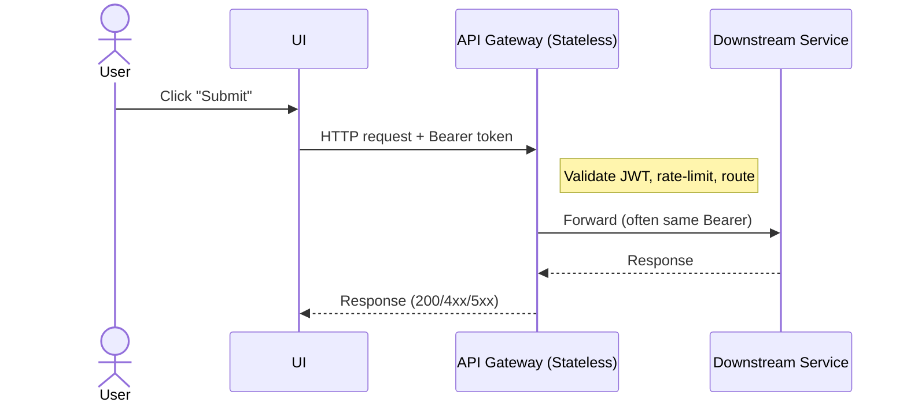

# Technical Architecture Document

## Traditional API Gateway vs. Session-Aware Agent Gateway

**Version:** 1.0
**Date:** October 28, 2025
**Audience:** Security Architects, Platform Engineering, API/Agent Developers, Compliance
**Related:** ADR-012 Agent Identity, ADR-013 DPoP, ADR-014 OBO/Token Exchange, ADR-015 Session-Aware Agent Gateway

---

## 1) Executive summary

Traditional API gateways are amazing at north-south traffic management (routing, rate-limits, TLS termination, coarse auth). But Zero Trust changes the unit of security from “network zone” to **every single request by every principal**—including **non-person entities** like AI agents and tools. That demands a gateway that understands **sessions, actors, delegation, and protocols** (e.g., MCP, A2A/AG-UI/ACP), not just URLs and headers. A **Session-Aware Agent Gateway (SAG)** becomes the policy enforcement point that correlates user + agent + workflow context, enforces *sender-constrained* tokens (DPoP/mTLS), and preserves an auditable **actor chain** using OBO (RFC 8693). This directly aligns with NIST Zero Trust guidance focusing controls on **users, assets, and resources** with continuous evaluation. ([NIST Computer Security Resource Center][1])

---

## 2) What each gateway is responsible for

### 2.1 Traditional API Gateway — roles & responsibilities

* L7 routing, URL/path-based dispatch, header manipulation, request/response transforms
* TLS termination; optional mTLS at edge; WAF integration and IP-based controls
* **Stateless** authentication checks (API keys/JWT verification) and coarse authorization (scope or role checks)
* Rate limiting, burst control, caching, request shaping
* Basic observability (access logs, latency/throughput/error metrics)

> Limits for agentic systems: no concept of multi-hop **actor chains**, weak handling of delegated access, no protocol awareness (MCP/streams), and little notion of *session risk*.

### 2.2 Session-Aware Agent Gateway — roles & responsibilities

* **Session graph**: correlate User-Session (USID), Workflow-Session (WSID), Agent-Session (ASID), and protocol sessions (e.g., MCP-Session, MSID); continuously evaluate risk
* **Identity for humans and agents**: verify user identity **and** **workload/agent identity** (SPIFFE SVID: X.509-SVID/JWT-SVID) per request/hop. ([SPIFFE][2])
* **Delegation & least privilege**: perform **OAuth 2.0 Token Exchange (OBO)** to carry **`act` (actor)** semantics and audience-restrict tokens for downstream calls. ([IETF Datatracker][3])
* **Sender-constrain tokens**: enforce **DPoP** for browser/edge and **mTLS-bound tokens** for service-to-service paths to stop token replay. ([RFC Editor][4])
* **Protocol-aware enforcement**: understand **MCP** (tool/resource discovery & calls) and other agent protocols (A2A/AG-UI/ACP) to enforce allow-lists, schema-level policies, DLP, consent, and step-up. ([Model Context Protocol][5])
* **Human-in-the-loop**: gate sensitive tool actions behind UI confirmations (AG-UI style streams), with reversible actions and audit trails
* **Kill-switch & revocation**: terminate agent sessions/streams and revoke exchanged tokens across all hops
* **Deep auditability**: record actor chain, session IDs, decision policy/version, PoP evidence (DPoP `jti` / mTLS binding), and tool provenance

---

## 3) Traits comparison (at-a-glance)

| Dimension                | Traditional API Gateway                                     | Session-Aware Agent Gateway                                                                                                                 |
| ------------------------ | ----------------------------------------------------------- | ------------------------------------------------------------------------------------------------------------------------------------------- |
| **Security model**       | Per-request checks, largely **stateless**                   | **Stateful** session graph + continuous evaluation (user + agent + workflow)                                                                |
| **Principals covered**   | Primarily human/app clients                                 | **Human + non-person entities** (agents/tools/services) as first-class principals (SPIFFE SVID) ([SPIFFE][2])                               |
| **Delegation**           | Often passes original bearer or uses generic service tokens | **OBO/Token Exchange (RFC 8693)**; preserved **actor chain**; audience-scoped downstream tokens ([IETF Datatracker][3])                     |
| **Token replay defense** | Bearer tokens (replayable)                                  | **DPoP (RFC 9449)** for apps/edge; **mTLS-bound tokens (RFC 8705)** service-to-service ([RFC Editor][4])                                    |
| **Protocol awareness**   | HTTP/REST/GraphQL only                                      | Understands **MCP** resources/tools & streaming; guards A2A/AG-UI/ACP message flows ([Model Context Protocol][5])                           |
| **Human-in-the-loop**    | Not modeled                                                 | Built-in consent/step-up on streams and tool calls                                                                                          |
| **Data egress/DLP**      | Header/body filters at best                                 | Schema-aware redaction, prompt/response filtering, tool output guardrails                                                                   |
| **Secrets safety**       | Prone to “bearer forwarding”                                | Forces re-minted, **scoped** tokens per hop; strips secrets from prompts/context                                                            |
| **Authorization**        | Coarse (role/scope)                                         | **Contextual ABAC/ReBAC** using user, agent traits, session risk, tool capabilities                                                         |
| **Observability**        | Access logs per request                                     | **Actor chain**, session IDs (USID/WSID/ASID/MSID), PoP proofs, tool provenance                                                             |
| **Revocation**           | Token blacklist or TTL                                      | **Kill-switch fan-out**: end streams, revoke exchanged tokens, expire sessions                                                              |
| **Zero Trust alignment** | Partial                                                     | **Directly aligned with NIST SP 800-207** (users, assets, resources; continuous verification) ([NIST Computer Security Resource Center][1]) |
| **Interoperability**     | Vendor/API specific                                         | Open-protocol adapters (MCP today; extensible to A2A/AG-UI/ACP) ([Model Context Protocol][5])                                               |

---

## 4) Reference architecture

**Control plane**

* **Security Token Service (STS):** OAuth 2.0 **Token Exchange (RFC 8693)**; introspection; revocation; policy on `act`/`may_act` & audiences. ([IETF Datatracker][3])
* **Identity fabric (workloads):** **SPIFFE/SPIRE** to issue and rotate SVIDs for agents/tools. ([SPIFFE][2])
* **Policy engine:** Policy-as-Code for ABAC/ReBAC (rules on user, agent, session, resource, tool schema)
* **Registry:** Tools & capability catalog (MCP servers/resources; A2A/ACP capability cards)
* **Observability:** Session graph store, audit lake, SIEM exports

**Data plane**

* **Session-Aware Agent Gateway:** Protocol adapters (MCP, AG-UI streams, A2A/ACP), DPoP/mTLS enforcement, OBO minting, DLP filters
* **Agents & Tools:** Agents authenticate with SVID and sender-constrained tokens; tools exposed via MCP servers
* **Applications & UIs:** Web/mobile clients emit DPoP proofs; AG-UI events gated for consent

---

## 5) Sequence diagrams

### 5.1 Traditional API Gateway (stateless path)



> No actor chain, no PoP binding, no awareness of tools/streams; bearer replay risk remains.

### 5.2 Session-Aware Agent Gateway (Zero Trust path)

```mermaid
sequenceDiagram
  actor User
  participant UI
  participant SAG as Session-Aware Agent Gateway
  participant STS as STS (Token Exchange)
  participant Agent
  participant MCP as MCP Server / Tool API

  User->>UI: Start task (USID)
  UI->>SAG: Request + DPoP proof
  SAG->>STS: Token Exchange (OBO) { act: user, audience: Agent }
  STS-->>SAG: Downstream token (DPoP-bound)
  SAG->>Agent: Invoke with ASID + actor token
  Agent->>SAG: Tool call (DPoP) + actor context
  SAG->>MCP: Enforce allow-list & schema; call with DPoP + OBO token
  MCP-->>SAG: Result (redacted/filtered)
  SAG-->>UI: Stream updates (AG-UI); prompt user consent if sensitive
```

> Actor chain preserved (OBO), sender-constrained tokens (DPoP/mTLS), protocol-aware checks (MCP), human-in-the-loop where needed. ([IETF Datatracker][3])

---

## 6) Policy model (how SAG makes decisions)

* **Identity signals:**

  * Human identity (IdP claims, device posture)
  * **Agent identity (SVID)**: trust domain & workload selectors (e.g., `spiffe://prod.example/agents/care-coordinator`). ([SPIFFE][2])
* **Delegation signals:** **`act`** chain from **RFC 8693**; verify `may_act` and audience per hop. ([IETF Datatracker][3])
* **Proof-of-possession:** **DPoP** (`htm`,`htu`,`jti`,`ath`), or **mTLS** certificate-bound tokens. ([RFC Editor][4])
* **Protocol guards:**

  * **MCP**: tool/resource allow-lists, schema-constrained inputs/outputs, redaction/DLP, rate/rules per tool kind. ([Model Context Protocol][5])
  * **AG-UI**: wire-up consent & step-up policies for irreversible actions.
* **Session risk:** correlate USID/WSID/ASID/MSID; add step-up or block on anomaly

---

## 7) RACI — who does what

| Capability                            | Security/Identity | Platform/Infra | App/Agent Team | Data/Compliance |
| ------------------------------------- | ----------------- | -------------- | -------------- | --------------- |
| SPIFFE/SPIRE deployment               | **R**             | **A**          | C              | C               |
| STS (RFC 8693) policy                 | **A**             | R              | C              | C               |
| DPoP/mTLS enforcement                 | **A**             | **R**          | C              | C               |
| Protocol adapters (MCP/AG-UI/A2A/ACP) | C                 | **R/A**        | **R**          | C               |
| Tool allow-lists & schemas            | C                 | R              | **A/R**        | **C**           |
| DLP/redaction rules                   | **A**             | R              | C              | **R**           |
| Session graph & audit lake            | **A**             | **R**          | C              | C               |
| Incident response / kill-switch       | **A**             | **R**          | C              | C               |

(A=Accountable, R=Responsible, C=Consulted)

---

## 8) Non-functional requirements & KPIs

* **Security:** 0 successful token replay in red-team tests (DPoP/mTLS enforced); 100% of user-context downstream calls carry **`act`**. ([RFC Editor][4])
* **Latency overhead:** ≤5ms median per hop for PoP verification & policy decision
* **Revocation:** Mean time to kill an agent session (tokens + streams) ≤5 minutes
* **Coverage:** ≥95% of MCP/A2A/AG-UI/ACP traffic traverses SAG protocol adapters

---

## 9) Migration blueprint (API GW → SAG)

1. **Lay identity foundations:** roll out SPIRE for agents; propagate SVIDs to workloads. ([SPIFFE][6])
2. **Enable STS OBO:** introduce Token Exchange for the first downstream API; log **actor chain** and audience. ([IETF Datatracker][3])
3. **Turn on PoP:** require DPoP on browser/mobile; mTLS-bound tokens for service-to-service. ([RFC Editor][4])
4. **Introduce protocol adapters:** start with **MCP** for tool calls; define tool registry & allow-lists. ([Model Context Protocol][5])
5. **Cutover policies:** move coarse scopes from API GW to SAG as contextual ABAC/ReBAC; deprecate bearer forwarding
6. **Kill-switch drills:** exercise termination of ASID/MSID and token revocation end-to-end

---

## 10) Risks & mitigations

* **Operational complexity:** mitigate with SDKs/middlewares for DPoP/OBO/MCP; progressive rollout
* **Legacy clients:** front with shim that upgrades credentials (exchange opaque → JWT AT per RFC 9068) and adds DPoP where possible. ([IETF Datatracker][7])
* **Protocol churn:** MCP is versioned with date-based scheme; keep adapters thin and upgradeable. ([Model Context Protocol][8])

---

## 11) Minimal data & log schema (SAG)

* `usid`, `wsid`, `asid`, `msid` — session IDs (user, workflow, agent, protocol)
* `sub` (user), `spiffe_id` (agent), `act` chain, `aud`
* `dpop`: `jti`, `htu`, `htm`, `ath` (or `mtls_thumbprint`)
* `tool`/`resource` (MCP), schema version, allow-list match, DLP actions
* `policy_id` and decision; latency; decision rationale

---

## 12) References (key standards & specs)

* **NIST SP 800-207 – Zero Trust Architecture.** Focus on users, assets, and resources with continuous verification. ([NIST Computer Security Resource Center][1])
* **NIST SP 800-207A – ZTA Model for Cloud-Native, Multi-Location Apps.** ([NIST Publications][9])
* **CISA Zero Trust Maturity Model v2.0.** ([CISA][10])
* **RFC 8693 – OAuth 2.0 Token Exchange (OBO / actor chain).** ([IETF Datatracker][3])
* **RFC 9449 – DPoP (sender-constraining tokens, replay detection).** ([RFC Editor][4])
* **RFC 8705 – OAuth 2.0 mTLS (certificate-bound tokens).** ([RFC Editor][11])
* **RFC 9068 – JWT Profile for OAuth 2.0 Access Tokens.** ([IETF Datatracker][7])
* **RFC 7800 – JWT `cnf` (PoP key semantics).** ([IETF Datatracker][12])
* **SPIFFE/SPIRE – SVID concepts & workload identity.** ([SPIFFE][2])
* **Model Context Protocol (MCP) – specification & versioning.** ([Model Context Protocol][5])

---

### Bottom line

If you only need URLs, scopes, and rate limits, a traditional API gateway suffices. If you need **Zero Trust for agentic systems**—verifiable agents, **actor-aware delegation**, per-step **protocol-aware** controls, and **instant revocation**—you need a **Session-Aware Agent Gateway**.

[1]: https://csrc.nist.gov/pubs/sp/800/207/final?utm_source=chatgpt.com "SP 800-207, Zero Trust Architecture | CSRC"
[2]: https://spiffe.io/docs/latest/spiffe-about/spiffe-concepts/?utm_source=chatgpt.com "SPIFFE Concepts"
[3]: https://datatracker.ietf.org/doc/html/rfc8693?utm_source=chatgpt.com "RFC 8693 - OAuth 2.0 Token Exchange"
[4]: https://www.rfc-editor.org/rfc/rfc9449.html?utm_source=chatgpt.com "OAuth 2.0 Demonstrating Proof of Possession (DPoP)"
[5]: https://modelcontextprotocol.io/specification/2025-06-18?utm_source=chatgpt.com "Specification"
[6]: https://spiffe.io/docs/latest/deploying/svids/?utm_source=chatgpt.com "Working with SVIDs"
[7]: https://datatracker.ietf.org/doc/html/rfc9068?utm_source=chatgpt.com "RFC 9068 - JSON Web Token (JWT) Profile for OAuth 2.0 ..."
[8]: https://modelcontextprotocol.io/specification/versioning?utm_source=chatgpt.com "Versioning"
[9]: https://nvlpubs.nist.gov/nistpubs/SpecialPublications/NIST.SP.800-207A.pdf?utm_source=chatgpt.com "A Zero Trust Architecture Model for Access Control in Cloud ..."
[10]: https://www.cisa.gov/sites/default/files/2023-04/zero_trust_maturity_model_v2_508.pdf?utm_source=chatgpt.com "Zero Trust Maturity Model Version 2.0"
[11]: https://www.rfc-editor.org/rfc/rfc8705.html?utm_source=chatgpt.com "RFC 8705: OAuth 2.0 Mutual-TLS Client Authentication ..."
[12]: https://datatracker.ietf.org/doc/rfc7800/?utm_source=chatgpt.com "RFC 7800 - Proof-of-Possession Key Semantics for JSON ..."
